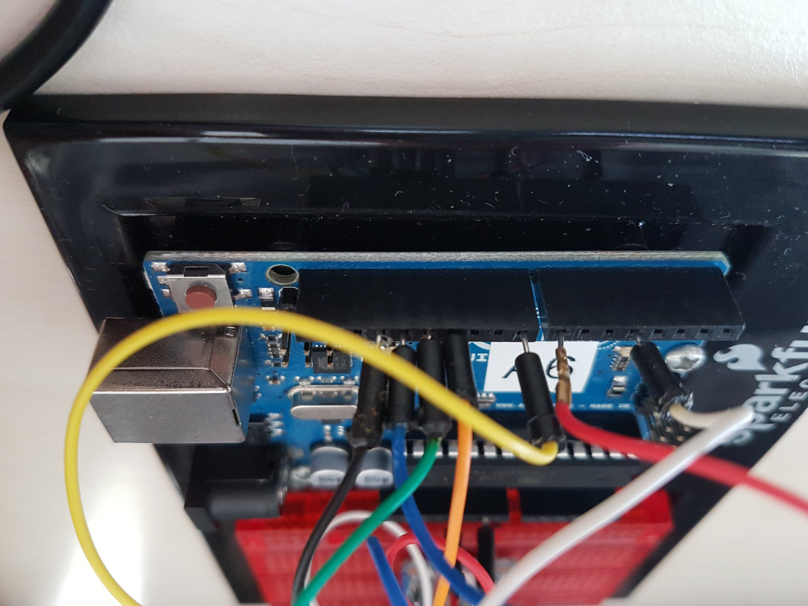
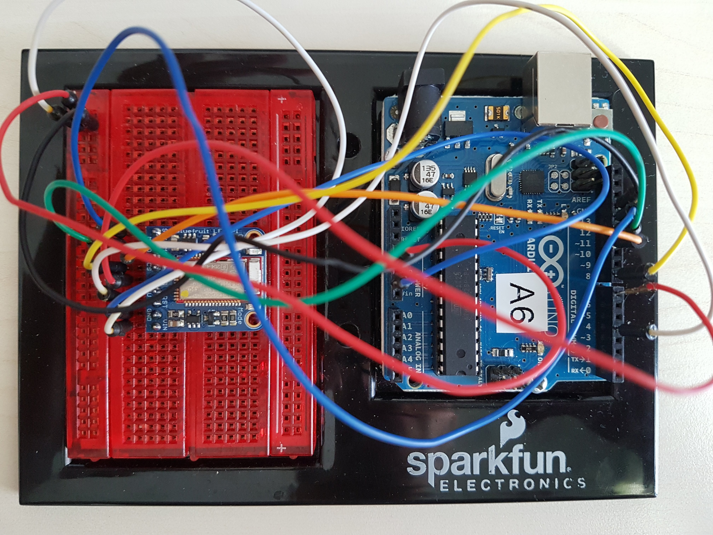
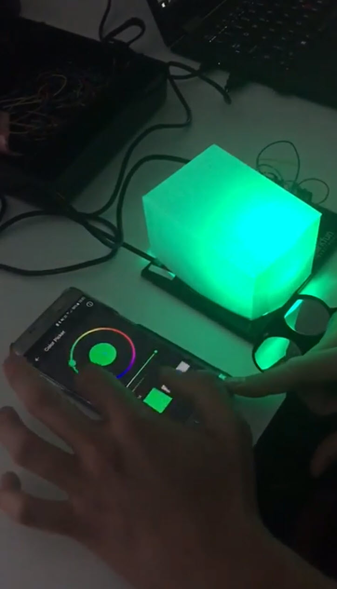

# Ambient Light mit Bluetooth

Das Projekt wird von mir im Rahmen einer Studentenarbeit an der technischen Fachhochschule Nordwestschweiz durchgeführt.

## Idee
Mit einem Arduino sollen verschiedene LEDs einer Lampe angesteuert werden können. Eine zusätzlich App soll so zur Steuerung der LEDs per Bluetooth verwendet werden können, dass die Lampe verschieden Farbtöne produziert und so für angenehmes Ambiente sorgt. 

## Video Endergebnis
[DemoVideo](https://youtu.be/ljIRN8pycBI)  

